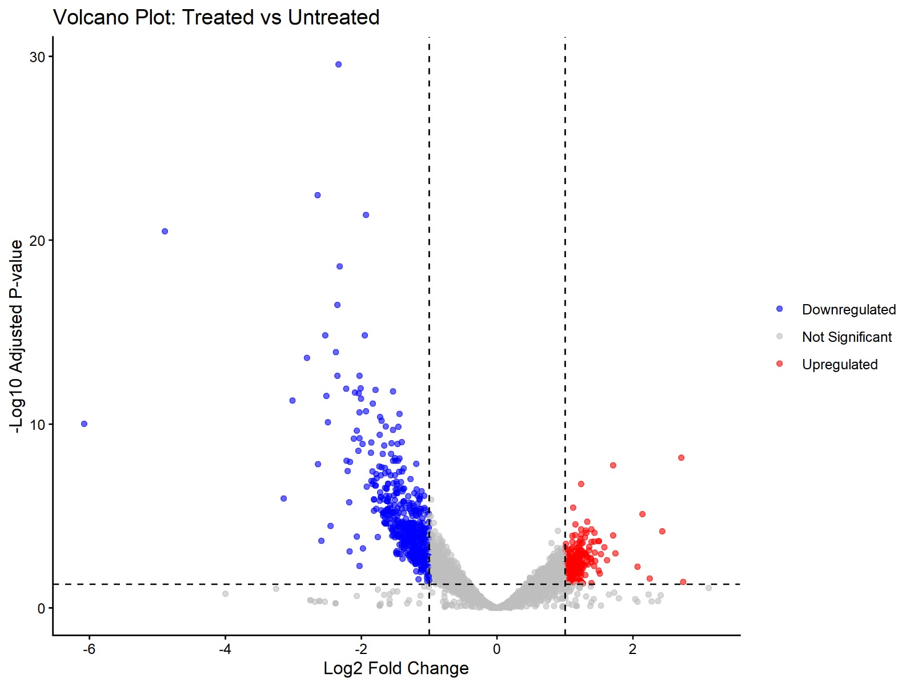
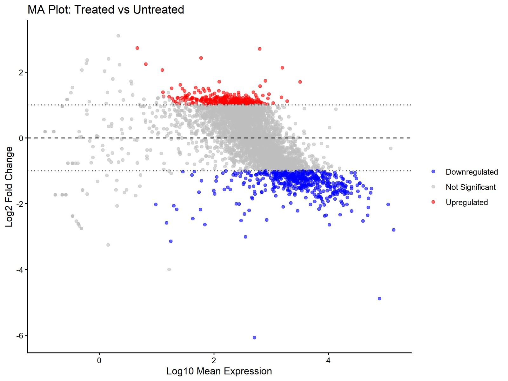
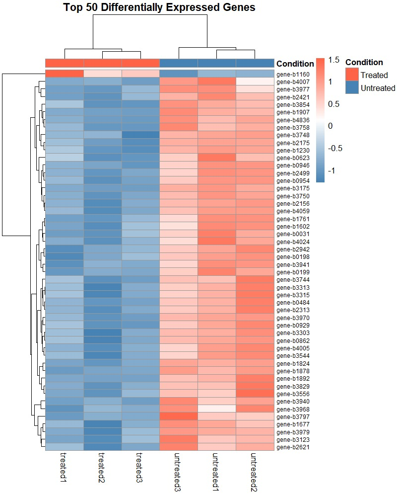
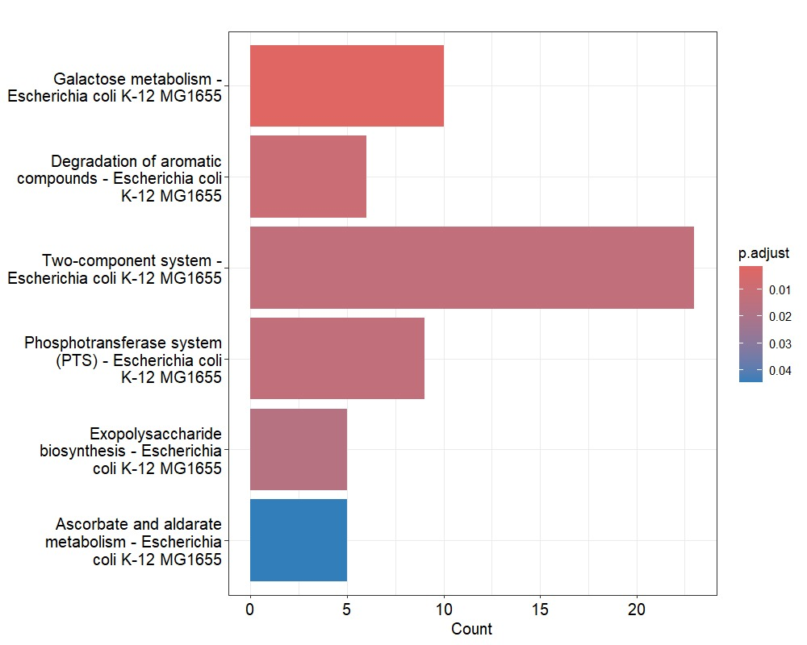
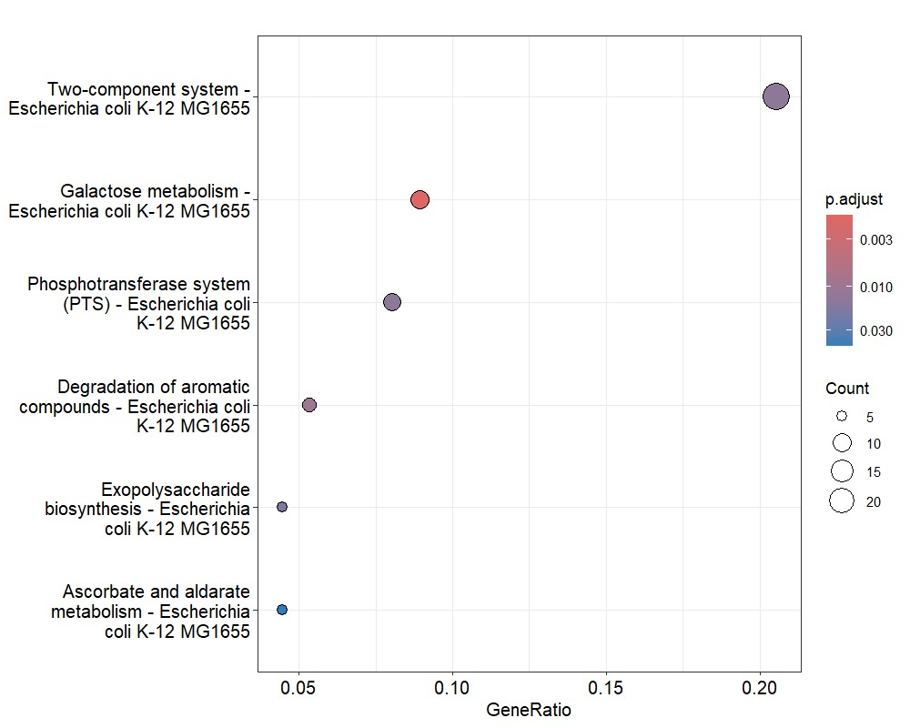
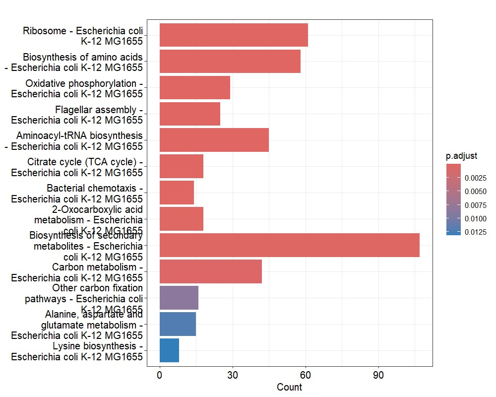
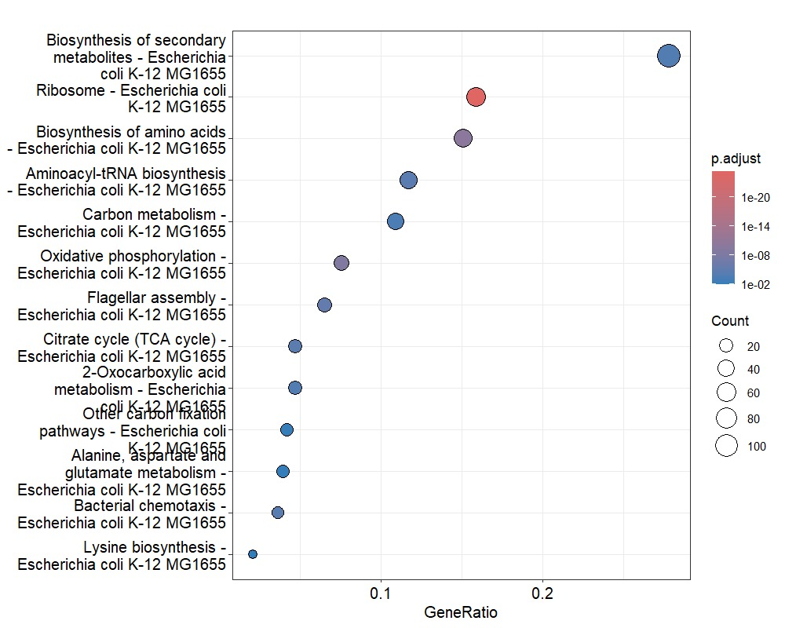

# E. coli RNA-seq Differential Expression Analysis

RNA-seq analysis comparing **treated vs. untreated** *Escherichia coli* K-12 MG1655, covering differential expression (DESeq2) and functional enrichment (KEGG pathway analysis).

## Overview

- **Organism:** *Escherichia coli* K-12 MG1655
- **Design:** 3 treated replicates vs. 3 untreated replicates
- **DE tool:** DESeq2
- **Enrichment:** KEGG pathway over-representation analysis (clusterProfiler)
- **Thresholds:** |log2FoldChange| ≥ 1, adjusted p-value (padj) < 0.05

## Results Summary

| Metric | Value |
|---|---|
| Total genes tested | 4,651 |
| Upregulated in treated (padj < 0.05, log2FC ≥ 1) | 539 |
| Downregulated in treated (padj < 0.05, log2FC ≤ -1) | 344 |
| Enriched KEGG pathways (upregulated genes) | 6 |
| Enriched KEGG pathways (downregulated genes) | 13 |

Top enriched pathways among **downregulated** genes include ribosome, biosynthesis of amino acids, oxidative phosphorylation, and flagellar assembly — consistent with a broad shutdown of growth and translation machinery under treatment.

Top enriched pathways among **upregulated** genes include the two-component system, galactose metabolism, and the phosphotransferase system (PTS) — suggesting an active stress/adaptive signaling and alternative carbon-source response.

## Repository Structure

```
.
├── data/
│   └── deseq_results.csv          # Full DESeq2 output (all genes, unfiltered)
├── results/
│   ├── figures/
│   │   ├── volcano_plot.jpeg
│   │   ├── MA_plot.jpeg
│   │   ├── heatmap_top50_DEGs.jpeg
│   │   ├── KEGG_upregulated_barplot.jpeg
│   │   ├── KEGG_upregulated_dotplot.jpeg
│   │   ├── KEGG_downregulated_barplot.jpeg
│   │   └── KEGG_downregulated_dotplot.jpeg
│   └── tables/
│       ├── KEGG_upregulated.csv
│       └── KEGG_downregulated.csv
├── scripts/                        # Add your analysis scripts here (see below)
├── .gitignore
└── README.md
```

> **Note:** Raw FASTQ/FASTA files, trimmed reads, and BAM/count files are **not** included in this repo (too large for GitHub). See [Reproducing the Analysis](#reproducing-the-analysis) below for the expected pipeline and where to host raw data.

## Figures

| Volcano Plot | MA Plot |
|---|---|
|  |  |

| Heatmap (Top 50 DEGs) |
|---|
|  |

| KEGG Upregulated (Bar) | KEGG Upregulated (Dot) |
|---|---|
|  |  |

| KEGG Downregulated (Bar) | KEGG Downregulated (Dot) |
|---|---|
|  |  |

## Methods

1. **Quality control & trimming** of raw FASTQ reads (e.g., FastQC + Trimmomatic/fastp).
2. **Alignment** of reads to the *E. coli* K-12 MG1655 reference genome (e.g., Bowtie2/HISAT2).
3. **Quantification** of gene-level counts (e.g., featureCounts/HTSeq).
4. **Differential expression** with `DESeq2` in R, comparing treated vs. untreated (3 replicates each).
5. **Visualization**: volcano plot, MA plot, and heatmap of top 50 DEGs (variance-stabilized/normalized counts, hierarchically clustered).
6. **Functional enrichment**: KEGG over-representation analysis (`clusterProfiler`) run separately on significantly up- and down-regulated gene sets against the *E. coli* K-12 MG1655 KEGG background.

> Edit this section to reflect the exact tools/versions/parameters you used — add version numbers for full reproducibility.

## Reproducing the Analysis

```bash
# 1. Clone the repo
git clone https://github.com/<your-username>/<repo-name>.git
cd <repo-name>

# 2. Add your raw FASTA/FASTQ files (not tracked in git — see .gitignore)
mkdir -p raw_data

# 3. Run your pipeline scripts (place them in scripts/)
#    e.g.:
#    bash scripts/01_qc_trim.sh
#    bash scripts/02_align_count.sh
#    Rscript scripts/03_deseq2_analysis.R
#    Rscript scripts/04_kegg_enrichment.R
```

## Requirements

- R (≥ 4.0) with `DESeq2`, `clusterProfiler`, `org.EcK12.eg.db`, `ggplot2`, `pheatmap`/`ComplexHeatmap`
- Read alignment/QC tools of your choice (e.g., FastQC, fastp, Bowtie2/HISAT2, featureCounts)

## License

Add a license of your choice (e.g., MIT) — see `LICENSE`.

## Citation

If you use this analysis, please cite this repository and the relevant tools (DESeq2, clusterProfiler).
